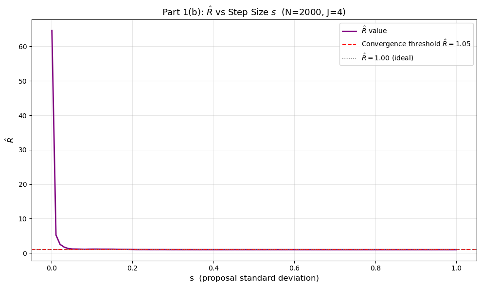

#  Random Walk Metropolis: Sampling a Laplace Distribution

A from-scratch implementation of the **Random Walk Metropolis** algorithm (a member of the Markov Chain Monte Carlo family), used to sample from a Laplace distribution and formally checked for convergence using the **Gelman–Rubin $\hat{R}$ diagnostic**.

> 📄 **Full write-up:** [`report/Random_Walk_Metropolis_Report.md`](report/Random_Walk_Metropolis_Report.md)



---

## Overview

The goal is to generate samples $x_1, \dots, x_N$ from

$$f(x) = \frac{1}{2}e^{-|x|}$$

— the Laplace (double exponential) distribution using only a simple accept/reject random-walk rule, without ever sampling from $f(x)$ directly. Two questions are addressed:

| # | Question |
|---|---|
| **(a)** | Do the generated samples reproduce the target distribution's histogram, density, mean, and standard deviation? |
| **(b)** | Has the chain actually converged, and how sensitive is convergence to the proposal step size $s$? |

---

## Repository Structure

```
.
├── README.md
├── report/
│   ├── Random_Walk_Metropolis_Report.md   ← full formatted write-up
│   └── assets/                            ← figures used in the report
└── code/
    └── random_walk_metropolis.py          ← analysis script 
```

---

## Methodology & Key Findings

### (a) Histogram, KDE & Monte Carlo estimates (N = 10,000, s = 1)
Starting at $x_0 = 0$, each candidate is drawn from $\text{Normal}(x_{i-1}, s)$ and accepted using the numerically stable log-ratio criterion $\log u < \log f(x^{*}) - \log f(x_{i-1})$.

- **Finding:** the Monte Carlo mean (0.01946) and standard deviation (1.49280) closely match the theoretical values (0.00000 and 1.41421), confirming the sampler recovers the target distribution.

### (b) Convergence diagnostic — Gelman–Rubin $\hat{R}$ (N = 2000, J = 4)
Four chains were run from different starting points ($x_0 \in \{0,1,2,3\}$) and compared via within-chain vs. between-chain variance.

- **Finding:** at a tiny step size ($s = 0.001$), the chain barely moves and $\hat{R} = 56.95$ a clear convergence failure. At a well-chosen step size ($s \approx 0.738$), $\hat{R} \approx 1.0001$ — well under the conventional $\hat{R} < 1.05$ threshold. The optimal step-size region for this target is roughly $s \in [0.5, 1.0]$.

Full derivations, formulas, and both figures are in the [full report](report/Random_Walk_Metropolis_Report.md).

---

## Tech Stack

- **Sampling & numerics:** `NumPy`
- **Density estimation:** `SciPy` (`gaussian_kde`)
- **Visualization:** `Matplotlib`
- **Reproducibility:** fixed random seed (`42`) throughout

---

## Reproducing the Analysis

1. Install dependencies:
   ```bash
   pip install numpy scipy matplotlib
   ```
2. Run the script:
   ```bash
   python code/random_walk_metropolis.py
   ```
   This will print the Monte Carlo estimates and $\hat{R}$ values to the console, and save both figures (`part1a_histogram_kde.png`, `part1b_rhat_plot.png`) to the working directory.

---

## References

- Gelman, A. and Rubin, D.B. (1992). *Inference from iterative simulation using multiple sequences.* Statistical Science, 7(4).
- Gilks, W.R., Richardson, S. and Spiegelhalter, D.J. (1996). *Markov Chain Monte Carlo in Practice.* Chapman and Hall.
- Harris, C.R. et al. (2020). *Array programming with NumPy.* Nature, 585.
- Virtanen, P. et al. (2020). *SciPy 1.0: Fundamental Algorithms for Scientific Computing in Python.* Nature Methods, 17.
- Hunter, J.D. (2007). *Matplotlib: A 2D Graphics Environment.* Computing in Science & Engineering.

---

## Course Context

Completed as coursework for **ST2195 – Programming for Data Science**. The original assignment also included a US flight-delay analysis component, which is intentionally excluded here and tracked as a separate project.

*Author: Kennith Babu*
